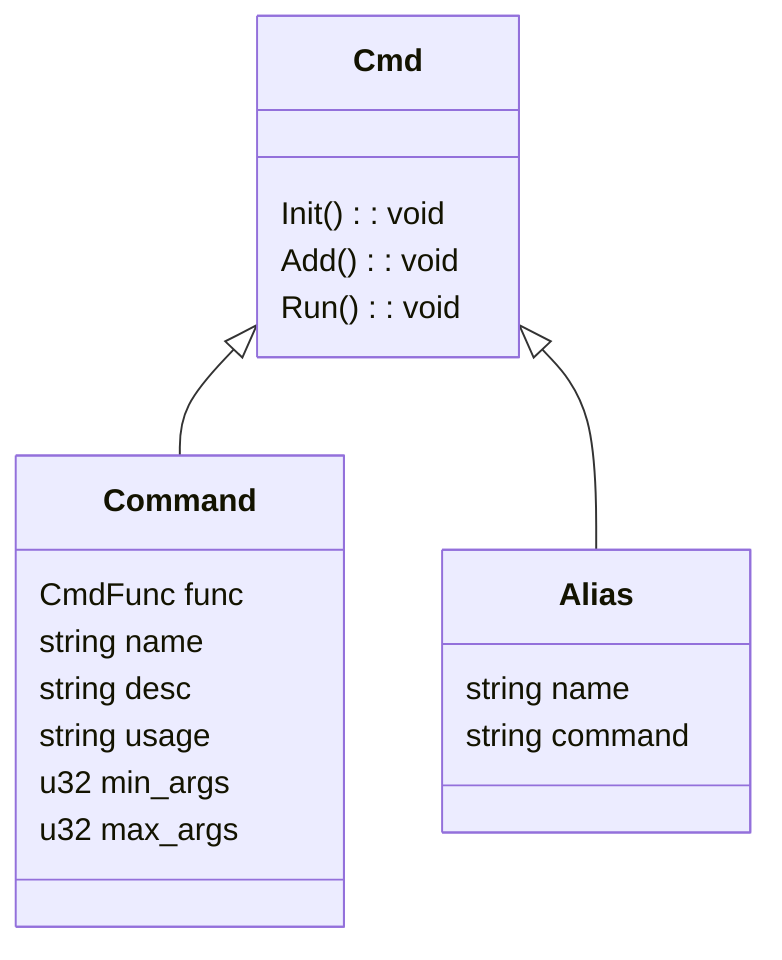

   
# deshi Command   
   
---   
The command system for deshi. Below is the namespace layout for Cmd   
   

```mermaid
classDiagram
	class Cmd{
		Init(): void
		Add(): void
		Run(): void
	}
	class Command{
		CmdFunc func
		string name
		string desc
		string usage
		u32 min_args
		u32 max_args
	
	}
	class Alias{
		string name
		string command
	}
	Cmd<|--Command
	Cmd<|--Alias

```
   
   
**TODO-DOCS**